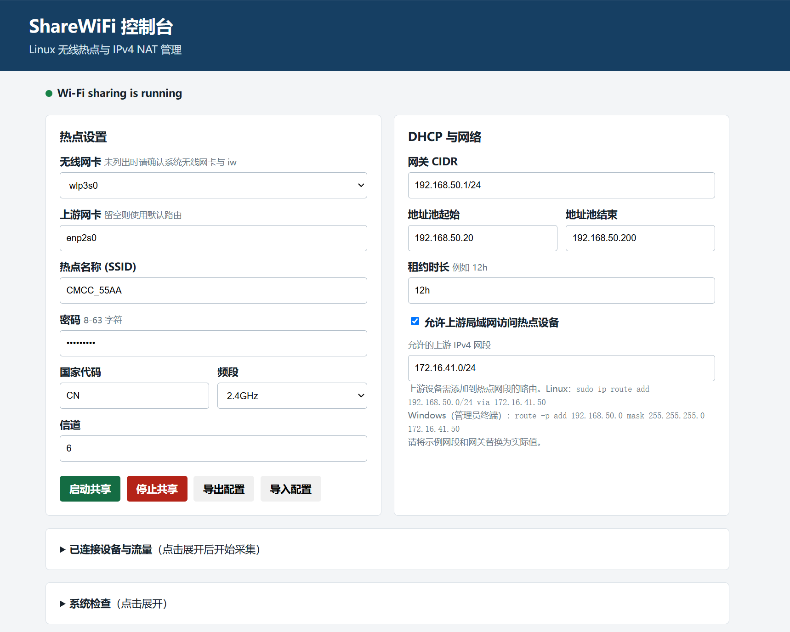
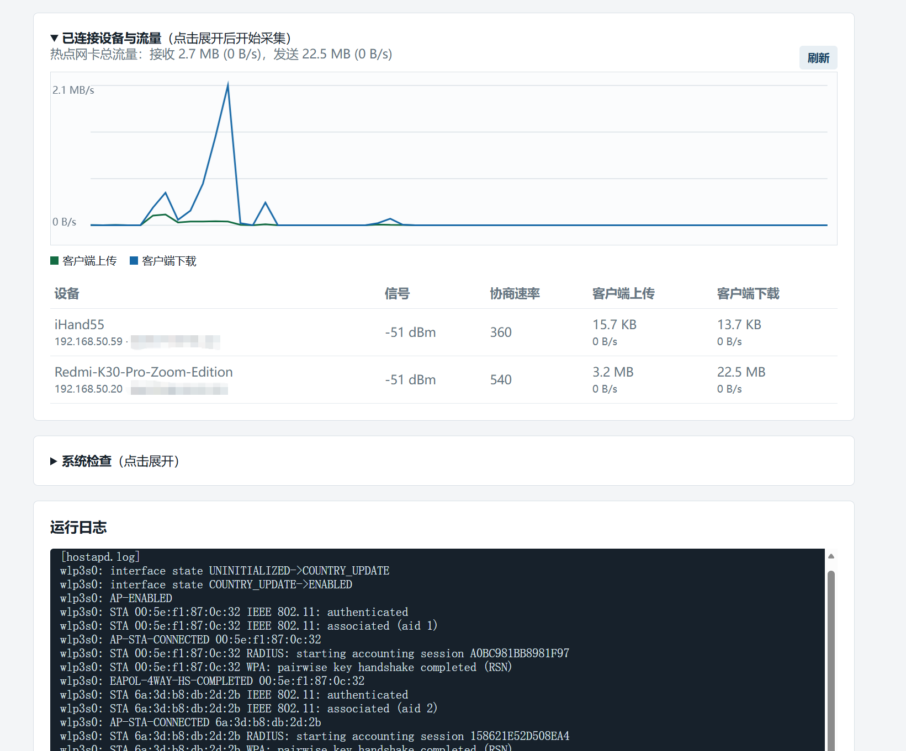
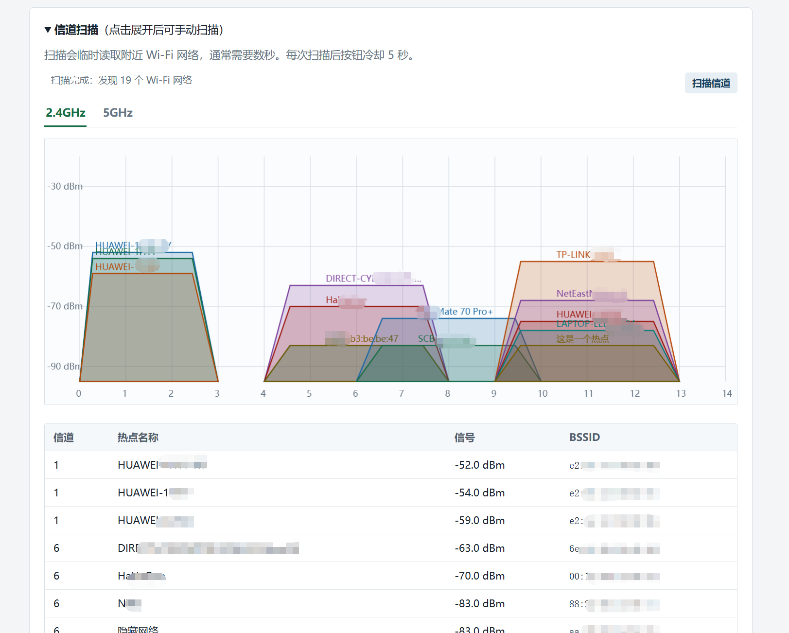

# ShareWiFi

ShareWiFi 是一个 Linux Wi-Fi 热点共享管理程序。它以单一 Go 二进制运行，内嵌中文 Web 控制台，使用 `hostapd` 创建 WPA2 热点，优先使用 `dnsmasq`、不可用时使用 `udhcpd` 分配 DHCP 地址，并通过 IPv4 NAT 共享主机的上游网络。

适用目标为 Debian/Ubuntu、Fedora、CentOS/RHEL 等 Linux 发行版。程序必须以 root 权限运行。

## 界面预览

### 热点配置与状态



### 设备流量、网速图与运行日志



### 信道扫描



## 功能

- 提供中文 Web 控制台，默认监听 `0.0.0.0:8080`。
- 自动检查 root 权限、无线网卡、AP 模式支持和系统依赖，并给出 Debian/Ubuntu、Fedora/CentOS 的安装命令。
- 配置无线网卡、SSID、WPA2 密码、国家代码、频段、信道、热点网关和 DHCP 地址池。
- 根据所选无线网卡显示支持的频段和信道；不支持 5GHz 的网卡会禁用 5GHz 选项。
- 信道支持“自动选择空闲信道”（位于信道列表末尾）。启动前扫描附近无线网络并选择占用较少的候选信道。无线能力读取或解析失败时，页面会给出警告、回退到内置的固定 2.4GHz/5GHz 信道表，并要求手动选择信道。
- 自动探测默认路由上游接口，也可手动指定。
- 自动优先使用 `nftables`，不存在时使用 `iptables`，配置 IPv4 转发与 NAT。
- 使用 NetworkManager 的机器上，临时停止其管理热点网卡；正常停止热点时自动恢复。
- 导入、导出热点 JSON 配置；可由 `-config` 参数直接启动热点。
- 支持延迟按 JSON 配置启动热点。
- 支持可选 HTTP Basic Auth 控制台认证。
- 页面显示 `hostapd` 与当前 DHCP 后端的启动日志和错误日志。
- 按需显示已连接设备的 MAC、IP、DHCP 主机名、信号、协商速率、累计流量和近似实时速率。
- 按需显示热点总上传、下载网速图表；监控面板收起时不会采集客户端或流量数据。
- 提供按需信道扫描面板，点击扫描后将附近 Wi-Fi 网络按 2.4GHz、5GHz 分别绘制为信道占用图；不支持 5GHz 的网卡不显示对应图表。扫描按钮每次点击后冷却 5 秒，不会在页面刷新或后台定时任务中扫描。
- 可选 `-info` 控制台诊断日志，输出执行的系统命令、用途和防火墙规则文本。

## 前置条件与依赖安装

无线网卡及其驱动必须支持 AP 模式。可使用以下命令检查，输出的 `Supported interface modes` 中应包含 `* AP`：

```sh
iw list
```

运行时依赖如下：

| 用途 | 命令 | 是否必需 |
| --- | --- | --- |
| 创建热点 | `hostapd` | 是 |
| DHCP | `dnsmasq` 或 `udhcpd` | 至少一个，优先 `dnsmasq` |
| 网络地址与路由配置 | `ip` | 是 |
| 无线网卡与 AP 能力检测 | `iw` | 是 |
| NAT | `nft` 或 `iptables` | 至少一个 |
| 客户端状态 | `hostapd_cli` | 否，通常随 `hostapd` 安装 |
| NetworkManager 协作 | `nmcli` | 否，检测到时使用 |

```sh
# Debian / Ubuntu
sudo apt update
sudo apt install hostapd dnsmasq iproute2 iw nftables

# 或者使用 udhcpd 替代 dnsmasq
sudo apt install udhcpd

# Fedora / CentOS / RHEL
sudo dnf install hostapd dnsmasq iproute iw nftables

# 或者使用 udhcpd 替代 dnsmasq
sudo dnf install udhcpd
```

## 快速使用

直接启动：

```sh
sudo ./sharewifi
```

随后访问 `http://主机地址:8080`，在页面选择无线网卡并填写热点参数，点击“启动共享”。

常用启动参数：

| 参数 | 说明 |
| --- | --- |
| `-listen 0.0.0.0:8080` | Web 控制台监听地址，默认值为 `0.0.0.0:8080`。 |
| `-workdir DIR` | 运行目录，保存生成的配置、DHCP 租约和运行日志。未指定时创建临时目录。 |
| `-username NAME -password PASS` | 同时提供时启用 HTTP Basic Auth。 |
| `-config FILE` | 读取热点 JSON 配置并启动热点。 |
| `-delay SECONDS` | 与 `-config` 同时使用时，延迟指定秒数后创建热点；默认 `0`。 |
| `-info` | 输出执行命令的用途、完整参数和 `nft` 规则，默认关闭。 |
| `-version` | 输出二进制版本号后退出。 |

Go 标准参数同时接受单横线和双横线，例如 `-config` 与 `--config` 等价。

### 控制台认证与诊断日志

```sh
sudo ./sharewifi \
  -listen 127.0.0.1:8080 \
  -username admin \
  -password 'replace-this-password' \
  -info
```

`-info` 只增加控制台诊断输出，不改变热点行为。

### 保存配置并从配置启动

网页中的“导出配置”会下载热点 JSON 文件。该 JSON 包含 Wi-Fi 密码；服务监听地址、运行目录、控制台用户名和密码仅由启动参数提供，不会写入 JSON。

```sh
# 立即按配置启动
sudo ./sharewifi -config /etc/sharewifi/home.json

# Web 控制台立即启动，30 秒后按配置创建热点
sudo ./sharewifi \
  -config /etc/sharewifi/home.json \
  -delay 30 \
  -workdir /var/lib/sharewifi \
  -listen 127.0.0.1:8080

# 后台执行，不显示日志
nohup sudo ./sharewifi-linux-amd64 \
   -username user1 -password passwd \
  -listen 0.0.0.0:8081 \
  -workdir /path/to/workdir \
  -config /path/to/config/sharewifi.json \
  -delay 30 > /dev/null 2>&1 &
```

延迟仅对 `-config` 生效，不影响网页中的手动“启动共享”。倒计时期间正常退出程序会取消尚未开始的热点创建。

配置示例：

```json
{
  "interface": "wlan0",
  "ssid": "ShareWiFi",
  "passphrase": "change-me-123",
  "country_code": "CN",
  "band": "2.4GHz",
  "channel": 6,
  "gateway_cidr": "192.168.50.1/24",
  "dhcp_start": "192.168.50.20",
  "dhcp_end": "192.168.50.200",
  "lease_time": "12h",
  "upstream_interface": "",
  "allow_upstream_lan": false,
  "upstream_lan_cidr": ""
}
```

`upstream_interface` 为空时使用默认 IPv4 路由的接口。启用 `allow_upstream_lan` 后，只有 `upstream_lan_cidr` 中的上游设备可主动访问热点网段。例如上游为 `172.16.41.0/24`、共享主机上游地址为 `172.16.41.50`、热点网段为 `192.168.50.0/24` 时，在页面填写 `172.16.41.0/24`，并在上游设备中添加路由：

将 JSON 中的 `channel` 设置为 `0`，或在页面选择“自动选择空闲信道”，程序会在启动前执行 `iw dev <无线网卡> scan`，统计候选信道上扫描到的附近 AP 数量，选择数量较少的信道；同等占用时优先 2.4GHz 的 1/6/11 或 5GHz 的 36/40/44/48。扫描完成后，程序会把选出的具体信道数值写入 `hostapd.conf`，而不是把“自动”交给 hostapd。扫描通常需要数秒；扫描失败时会使用上述首选信道，热点仍会继续启动。

```sh
# Linux
sudo ip route replace 192.168.50.0/24 via 172.16.41.50

# Windows，以管理员身份执行
route -p add 192.168.50.0 mask 255.255.255.0 172.16.41.50
```

## 手动安装(以 /opt/shareWifi 为例)

以下示例将程序、运行目录和热点 JSON 配置都放入 `/opt/shareWifi`，并创建开机自启的 systemd 服务。

### 1. 安装二进制并创建目录

在已构建出 `sharewifi` 的目录中执行：

```sh
sudo install -d -m 0750 /opt/shareWifi
sudo install -m 0755 ./sharewifi /opt/shareWifi/sharewifi
```

首次可手动运行程序，在网页完成热点配置并导出 JSON：

```sh
sudo /opt/shareWifi/sharewifi \
  -workdir /opt/shareWifi \
  -listen 0.0.0.0:8080
```

将导出的 JSON 放到 `/opt/shareWifi/sharewifi.json`，并限制目录与配置文件权限：

```sh
sudo install -m 0600 /path/to/sharewifi.json /opt/shareWifi/sharewifi.json
sudo chmod 0750 /opt/shareWifi
```

### 2. 创建 systemd 服务

创建 `/etc/systemd/system/sharewifi.service`：

```ini
[Unit]
Description=ShareWiFi hotspot manager
Wants=network-online.target
After=network-online.target NetworkManager.service

[Service]
Type=simple
WorkingDirectory=/opt/shareWifi
ExecStart=/opt/shareWifi/sharewifi -config /opt/shareWifi/sharewifi.json -workdir /opt/shareWifi -listen 0.0.0.0:8080
Restart=on-failure
RestartSec=5

[Install]
WantedBy=multi-user.target
```

控制台认证可在 `ExecStart` 末尾增加 `-username 用户名 -password 密码`。若控制台监听在局域网地址，请设置认证或通过网络访问控制限制访问来源。

### 3. 启用、查看和停止服务

```sh
sudo systemctl daemon-reload
sudo systemctl enable --now sharewifi.service

sudo systemctl status sharewifi.service
sudo journalctl -u sharewifi.service -f

# 停止并取消开机启动
sudo systemctl disable --now sharewifi.service
```

此安装方式下，`hostapd.conf`、当前 DHCP 后端的配置、租约和日志都保存在 `/opt/shareWifi`。使用 `dnsmasq` 时对应文件为 `dnsmasq.conf`、`dnsmasq.leases`、`dnsmasq.log`；使用 `udhcpd` 时对应文件为 `udhcpd.conf`、`udhcpd.leases`、`udhcpd.log`。

## 更多资料

软件架构、运行机制、限制条件、排障注意事项以及本地/交叉编译说明见 [DESIGN.md](DESIGN.md)。

## 仓库结构

```text
main.go       Go 服务、网络配置、进程管理和 API
web.html      嵌入二进制的中文 Web 控制台
img/          界面截图
README.md     工程介绍、功能与使用文档
DESIGN.md     软件设计、注意事项与编译文档
```
